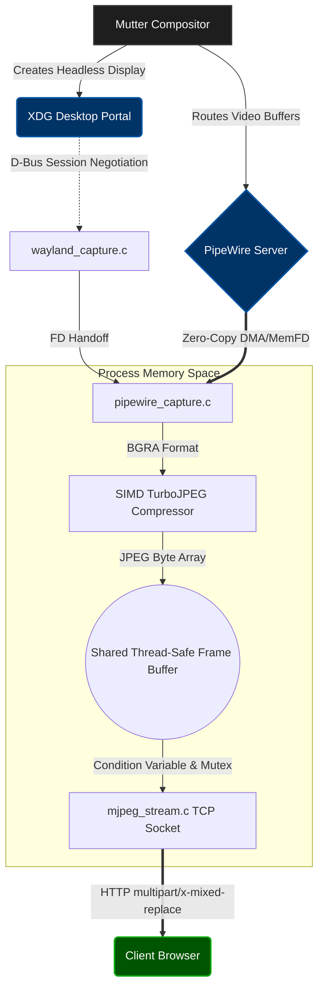

# Second Screen Linux: High-Performance Wayland Display Extension

## Abstract
This project implements a high-performance, ultra-low latency virtual display server for Linux environments running Wayland. By natively integrating with the XDG Desktop Portal via D-Bus and negotiating raw memory streams through PipeWire, the software circumvents the strict security boundaries of modern Wayland compositor architectures (e.g., Mutter) to provision headless virtual monitors entirely in user-space. The resulting architecture streams real-time Variable Bitrate (VBR) MJPEG over a custom-built, multithreaded TCP HTTP server.

## Theoretical Foundation and Throughput Analysis

Handling raw video buffers at 60 Frames Per Second (FPS) in user-space introduces critical memory bandwidth constraints. Let $W$ and $H$ represent the horizontal and vertical resolution respectively, $C$ the color depth in bytes per pixel (typically 4 for BGRA), and $F$ the target frame rate. The uncompressed memory throughput $B_{raw}$ required is defined as:

$$
B_{raw} = W \times H \times C \times F
$$

For a standard 1080p stream at 60 FPS:

$$
B_{raw} = 1920 \times 1080 \times 4 \times 60 \approx 497.66 \text{ MB/s}
$$

Processing $\approx 500 \text{ MB/s}$ on the CPU necessitates an execution pipeline where the total processing latency per frame $T_{total}$ satisfies a strict upper bound constraint:

$$
T_{total} = t_{dequeue} + t_{compress} + t_{copy} \le \frac{1000}{F} \text{ ms}
$$

For $F = 60$, $T_{total} \le 16.66 \text{ ms} $. To achieve this deterministic execution, we utilize Single Instruction, Multiple Data (SIMD) acceleration via `libjpeg-turbo`. This brings the algorithmic compression complexity down to $t_{compress} \approx 2-5 \text{ ms}$, ensuring zero frame dropping and robust V-Sync synchronization.

## Architecture Pipeline

The system is decomposed into three highly concurrent subsystems: D-Bus Orchestration, PipeWire Media Graph, and TCP/HTTP Stream Synchronization.



## Concurrency Model and Thread Safety

A naïve implementation of memory sharing between the GPU capturing thread and the TCP networking thread leads to race conditions, partial reads (screen tearing), and Thread Starvation. 

To resolve this, the architecture employs POSIX Threads (`pthreads`) utilizing a Mutex-locked Deep Copy strategy:

1. **State Mutation:** The PipeWire thread acquires the Mutex lock: `pthread_mutex_lock()`.
2. **Buffer Swap:** The compressed JPEG is written to the global heap, updating the active pointer.
3. **Thread Waking:** `pthread_cond_broadcast()` is invoked, elevating the sleeping HTTP thread to an active execution state without busy-waiting (maintaining 0% CPU consumption while the screen is idle).
4. **Deep Copy Protocol:** Upon awakening, the HTTP thread performs an atomic `memcpy()` of the JPEG buffer into a localized networking heap, immediately releasing the Mutex in $O(1)$ time complexity ($t_{copy} < 100 \mu s$). 
5. **Asynchronous I/O:** The TCP socket invokes `send()` iteratively with the `MSG_NOSIGNAL` flag, effectively saturating the network interface queue without blocking the internal PipeWire DMA pipeline.

## Implementation Specifics

### XDG Portal Virtual Monitor Provisioning
By manipulating the `SelectSources` schema of the `org.freedesktop.portal.ScreenCast` interface, the boolean mask for `SourceType` is shifted to `4` (Virtual Monitor). This implicitly forces the upstream Wayland compositor to provision a secondary frame buffer. In conjunction, the `cursor_mode = 2` bitmask is requested, instructing the compositor to hardware-embed the pointer into the contiguous stream buffer, deprecating the need for client-side JavaScript coordinate emulation.

### Continuous Multipart Protocol
Video transport is conducted over a standardized HTTP/1.1 response implementing the `multipart/x-mixed-replace` specification. This topology forces standard WebKit/Blink rendering engines to overwrite the existing DOM image asset continually, establishing an ultra-low latency unidirectional socket without the initialization overhead of a WebRTC stack.

## Dependencies and Build Instructions

The build system relies on standard POSIX headers and explicit GNOME/FreeDesktop user-space libraries.

### Prerequisites (Arch Linux / Manjaro)
```bash
sudo pacman -S pipewire glib2 libjpeg-turbo gcc make pkgconf
```

### Compilation
```bash
make clean && make
```

### Execution
```bash
./second_screen
```
Upon execution, the D-Bus abstraction layer will prompt a Wayland security dialog requesting authorization to instantiate and expose the virtual display. Once authenticated, the secondary stream is accessible via any web browser routing to `http://localhost:8080/`.

## License
Provided "as-is" for educational and high-performance computing research within the Linux Display Server ecosystem. Dependencies (`libpipewire`, `glib`, `libjpeg-turbo`) remain subjects of their original licensing distributions.
